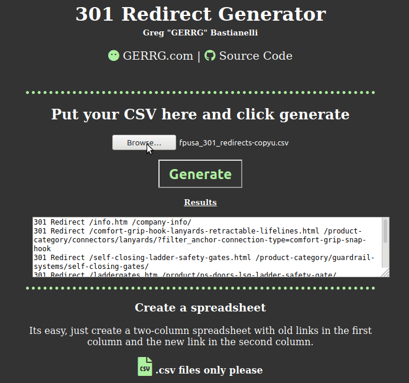

# 301 Redirect Generator
Built specifically to take in a two column .csv file of old and new URLS and quickly convert them to 301 redirect rules.

## Installation
First make sure you install `Papaparse` using your favorite package manager

`npm install papaparse`

### Usage
The 'application' is web based, open dist/index.html with your favorite browser, upload your .csv file and click 'generate'

